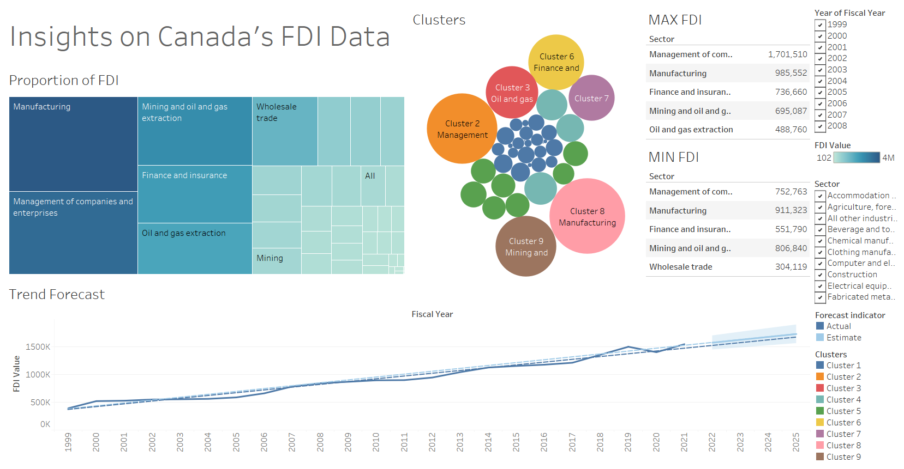

# Canada FDI Analysis
Analysis on Canada's Foreign Direct Investment by NAICS sectors from 1999 to 2022

### Dashboard

### Questions Answered
1. Which sector received the maximum direct funding for a given year?
2. Which sector received the minimum direct funding for a given year?
3. Is there a trend for direct investments for individual sectors?
4. In what fashion can the sectors be grouped for comparison?
5. Which sectors reported the highest growth in the past 5 years?
6. Which sectors reported the highest decline in the past 5 years?
7. Which sectors reported the most variation overall?
8. What is the proportion of investment between sectors from the FDI perspective?
9. Are there any specific clusters present in the data?
10. Can we forecast the trend for the following year?

### Files
- `Canada FDI Analysis.twb`: Tableau Analysis File
- `Cleaned FDI Data by NAICS.xlsx`: Excel Cleansed FDI Data
- `Original FDI Data by NAICS.xlsx`: Excel Original FDI Data
- `cleanserFDI.py`: Python Data Cleansing Script
- `Dashboard.png`: Exported Image of Tableau Dashboard

### Data Citation
`Statistics Canada. Table 36-10-0009-01  International investment position, Canadian direct investment abroad and foreign direct investment in Canada, by North American Industry Classification System (NAICS) and region, annual (x 1,000,000)`

https://www150.statcan.gc.ca/t1/tbl1/en/tv.action?pid=3610000901

### Questions Citation
`edureka!. Tableau Full Course [2024] in 10 Hours | Tableau Training for Beginners | Edureka`

https://www.youtube.com/live/dTVMR7yrGAI?si=KDg50kgK-MGfVClK